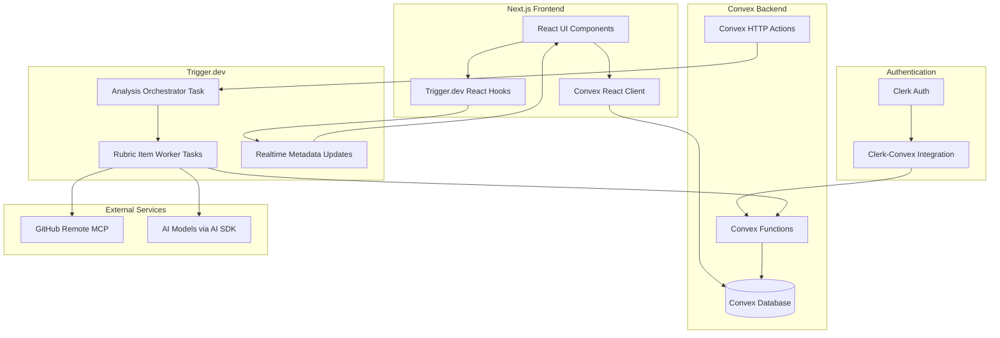

# Design Document: AI Code Review System

## Overview

The AI Code Review System is a web application that enables users to analyze GitHub repositories against customizable evaluation rubrics using AI agents. The system leverages Trigger.dev for parallelized background task execution, GitHub's remote MCP for repository access, the Vercel AI SDK for model interactions, Clerk for authentication, and Convex for real-time data management.

The architecture follows an orchestrator-workers pattern where a main analysis task coordinates parallel evaluation of individual rubric items, with real-time progress updates streamed to the frontend via Trigger.dev Realtime and Convex subscriptions.

## Architecture



## Components and Interfaces

### 1. Authentication Layer

**ClerkProvider Component**
- Wraps the application with Clerk authentication context
- Integrates with Convex via `ConvexProviderWithClerk`
- Handles sign-in/sign-out flows and session management

**Interface:**
```typescript
interface AuthenticatedUser {
  clerkId: string;
  email: string;
  name: string;
  imageUrl?: string;
}
```

### 2. Rubric Management Service

**RubricService (Convex Functions)**
- `createRubric`: Creates a new user rubric
- `updateRubric`: Updates rubric metadata and items
- `deleteRubric`: Soft-deletes a rubric
- `listRubrics`: Lists user rubrics and system templates
- `getRubric`: Retrieves a single rubric with items
- `duplicateSystemTemplate`: Creates a user copy of a system template

**Interfaces:**
```typescript
type EvaluationType = "yes_no" | "range" | "comments" | "code_examples";

interface RubricItemConfig {
  // For yes_no
  requireJustification?: boolean;
  
  // For range
  minValue?: number;
  maxValue?: number;
  
  // For code_examples
  maxExamples?: number;
}

interface RubricItem {
  _id: Id<"rubricItems">;
  rubricId: Id<"rubrics">;
  name: string;
  description: string;
  evaluationType: EvaluationType;
  config: RubricItemConfig;
  order: number;
}

interface Rubric {
  _id: Id<"rubrics">;
  userId?: Id<"users">; // null for system templates
  name: string;
  description: string;
  isSystemTemplate: boolean;
  createdAt: number;
  updatedAt: number;
}
```

### 3. System Template Loader

**TemplateLoader (Convex Internal Function)**
- Loads rubric templates from configuration on application initialization
- Upserts system templates in Convex database
- Preserves template IDs for historical analysis references

**Template Configuration Format:**
```typescript
interface SystemTemplateConfig {
  id: string; // Stable identifier
  name: string;
  description: string;
  items: Array<{
    name: string;
    description: string;
    evaluationType: EvaluationType;
    config: RubricItemConfig;
  }>;
}
```

### 4. Repository Connection Service

**RepositoryService (Convex Functions)**
- `connectRepository`: Validates and stores repository reference
- `listRepositories`: Lists user's connected repositories
- `validateAccess`: Checks if repository is still accessible

**Interface:**
```typescript
interface Repository {
  _id: Id<"repositories">;
  userId: Id<"users">;
  owner: string;
  name: string;
  fullName: string; // "owner/name"
  defaultBranch: string;
  connectedAt: number;
}
```

### 5. Analysis Orchestration (Trigger.dev Tasks)

**analyzeRepository Task (Orchestrator)**
- Creates analysis job record in Convex
- Fetches repository content via GitHub MCP
- Triggers parallel rubric item evaluations using `batch.triggerByTaskAndWait`
- Updates progress metadata for real-time UI updates
- Aggregates results and updates final status

**evaluateRubricItem Task (Worker)**
- Receives repository content and rubric item configuration
- Constructs appropriate AI prompt based on evaluation type
- Calls AI model via Vercel AI SDK
- Returns structured evaluation result
- Reports individual item completion to parent via metadata

**Interfaces:**
```typescript
interface AnalysisJobPayload {
  analysisId: string; // Convex ID
  repositoryId: string;
  rubricId: string;
  userId: string;
}

interface RubricItemPayload {
  analysisId: string;
  itemId: string;
  itemName: string;
  itemDescription: string;
  evaluationType: EvaluationType;
  config: RubricItemConfig;
  repositoryContent: RepositoryContent;
}

interface RepositoryContent {
  files: Array<{
    path: string;
    content: string;
    language: string;
  }>;
  structure: string; // Directory tree representation
}

interface EvaluationResult {
  itemId: string;
  evaluationType: EvaluationType;
  result: YesNoResult | RangeResult | CommentsResult | CodeExamplesResult;
  status: "completed" | "failed";
  error?: string;
}

interface YesNoResult {
  value: boolean;
  justification: string;
}

interface RangeResult {
  value: number;
  min: number;
  max: number;
  rationale: string;
}

interface CommentsResult {
  feedback: string;
}

interface CodeExamplesResult {
  examples: Array<{
    filePath: string;
    lineStart: number;
    lineEnd: number;
    code: string;
    explanation: string;
  }>;
}
```

### 6. Analysis Job Management (Convex Functions)

**AnalysisService**
- `createAnalysis`: Creates new analysis job with pending status
- `updateAnalysisProgress`: Updates item completion counts
- `updateItemResult`: Stores individual item evaluation result
- `completeAnalysis`: Marks analysis as completed with summary
- `failAnalysis`: Marks analysis as failed with error
- `getAnalysis`: Retrieves analysis with all results
- `listAnalyses`: Lists user's analysis history with filters

**Interfaces:**
```typescript
type AnalysisStatus = "pending" | "running" | "completed" | "failed";
type ItemStatus = "pending" | "processing" | "completed" | "failed";

interface Analysis {
  _id: Id<"analyses">;
  userId: Id<"users">;
  repositoryId: Id<"repositories">;
  rubricId: Id<"rubrics">;
  triggerRunId?: string;
  status: AnalysisStatus;
  totalItems: number;
  completedItems: number;
  failedItems: number;
  createdAt: number;
  completedAt?: number;
}

interface AnalysisItemResult {
  _id: Id<"analysisResults">;
  analysisId: Id<"analyses">;
  rubricItemId: Id<"rubricItems">;
  status: ItemStatus;
  result?: EvaluationResult["result"];
  error?: string;
  completedAt?: number;
}
```

### 7. Real-time Progress Component

**AnalysisProgress React Component**
- Uses `useRealtimeTaskTrigger` hook to trigger and subscribe to analysis
- Displays progress bar with completed/total items
- Shows individual item statuses (pending, processing, completed, failed)
- Updates automatically via Trigger.dev Realtime metadata

**Progress Metadata Structure:**
```typescript
interface AnalysisProgressMetadata {
  status: "initializing" | "fetching_repo" | "evaluating" | "completing";
  totalItems: number;
  completedItems: number;
  failedItems: number;
  currentItem?: string;
  items: Record<string, ItemStatus>;
}
```

### 8. Results Display Components

**ResultsView Component**
- Renders analysis results based on evaluation type
- `YesNoResultCard`: Boolean indicator with justification
- `RangeResultCard`: Score visualization with range context
- `CommentsResultCard`: Formatted markdown feedback
- `CodeExamplesResultCard`: Syntax-highlighted code snippets with annotations

**ExportService**
- `exportAsJSON`: Generates JSON export of analysis results
- `exportAsMarkdown`: Generates formatted Markdown report

## Data Models

### Convex Schema

```typescript
// schema.ts
import { defineSchema, defineTable } from "convex/server";
import { v } from "convex/values";

export default defineSchema({
  users: defineTable({
    clerkId: v.string(),
    email: v.string(),
    name: v.string(),
    imageUrl: v.optional(v.string()),
    createdAt: v.number(),
  }).index("by_clerk_id", ["clerkId"]),

  rubrics: defineTable({
    userId: v.optional(v.id("users")), // null for system templates
    name: v.string(),
    description: v.string(),
    isSystemTemplate: v.boolean(),
    systemTemplateId: v.optional(v.string()), // Stable ID for system templates
    createdAt: v.number(),
    updatedAt: v.number(),
    deletedAt: v.optional(v.number()),
  })
    .index("by_user", ["userId"])
    .index("by_system_template", ["isSystemTemplate"])
    .index("by_system_template_id", ["systemTemplateId"]),

  rubricItems: defineTable({
    rubricId: v.id("rubrics"),
    name: v.string(),
    description: v.string(),
    evaluationType: v.union(
      v.literal("yes_no"),
      v.literal("range"),
      v.literal("comments"),
      v.literal("code_examples")
    ),
    config: v.object({
      requireJustification: v.optional(v.boolean()),
      minValue: v.optional(v.number()),
      maxValue: v.optional(v.number()),
      maxExamples: v.optional(v.number()),
    }),
    order: v.number(),
  }).index("by_rubric", ["rubricId"]),

  repositories: defineTable({
    userId: v.id("users"),
    owner: v.string(),
    name: v.string(),
    fullName: v.string(),
    defaultBranch: v.string(),
    connectedAt: v.number(),
  })
    .index("by_user", ["userId"])
    .index("by_full_name", ["fullName"]),

  analyses: defineTable({
    userId: v.id("users"),
    repositoryId: v.id("repositories"),
    rubricId: v.id("rubrics"),
    triggerRunId: v.optional(v.string()),
    status: v.union(
      v.literal("pending"),
      v.literal("running"),
      v.literal("completed"),
      v.literal("failed")
    ),
    totalItems: v.number(),
    completedItems: v.number(),
    failedItems: v.number(),
    errorMessage: v.optional(v.string()),
    createdAt: v.number(),
    completedAt: v.optional(v.number()),
  })
    .index("by_user", ["userId"])
    .index("by_user_and_status", ["userId", "status"])
    .index("by_repository", ["repositoryId"])
    .index("by_trigger_run", ["triggerRunId"]),

  analysisResults: defineTable({
    analysisId: v.id("analyses"),
    rubricItemId: v.id("rubricItems"),
    status: v.union(
      v.literal("pending"),
      v.literal("processing"),
      v.literal("completed"),
      v.literal("failed")
    ),
    result: v.optional(v.any()), // Typed per evaluation type
    error: v.optional(v.string()),
    completedAt: v.optional(v.number()),
  })
    .index("by_analysis", ["analysisId"])
    .index("by_analysis_and_item", ["analysisId", "rubricItemId"]),
});
```


## Correctness Properties

*A property is a characteristic or behavior that should hold true across all valid executions of a system-essentially, a formal statement about what the system should do. Properties serve as the bridge between human-readable specifications and machine-verifiable correctness guarantees.*

Based on the acceptance criteria analysis, the following correctness properties must be validated:

### Property 1: User record synchronization
*For any* successful Clerk authentication, the Convex database SHALL contain a user record with a clerkId matching the authenticated user's Clerk ID.
**Validates: Requirements 1.2**

### Property 2: Rubric creation persistence
*For any* valid rubric name and description, creating a rubric SHALL result in a stored record retrievable by ID with matching name, description, empty items list, and the creating user's ID.
**Validates: Requirements 2.1**

### Property 3: Rubric item validation
*For any* rubric item creation attempt, the item SHALL only be stored if it contains a non-empty name, non-empty description, and valid evaluation type.
**Validates: Requirements 2.2**

### Property 4: Evaluation result structure matches type
*For any* completed evaluation result, the result structure SHALL match the evaluation type:
- yes_no: contains boolean `value` and string `justification`
- range: contains numeric `value` within configured `min`/`max` bounds, and string `rationale`
- comments: contains string `feedback`
- code_examples: contains array of examples, each with `filePath`, `lineStart`, `lineEnd`, `code`, and `explanation`
**Validates: Requirements 2.3, 2.4, 2.5, 2.6, 7.1, 7.2, 7.3, 7.4**

### Property 5: Rubric update persistence
*For any* rubric update operation with valid data, retrieving the rubric immediately after SHALL return the updated values.
**Validates: Requirements 2.7**

### Property 6: Soft delete preserves history
*For any* deleted rubric that has been used in analyses, the rubric SHALL not appear in user's rubric list, but historical analyses SHALL still be retrievable with their original rubric reference.
**Validates: Requirements 2.8**

### Property 7: Rubric listing includes both types
*For any* authenticated user, listing available rubrics SHALL return both user-created rubrics (with userId matching the user) and system templates (with isSystemTemplate=true), with each rubric correctly flagged.
**Validates: Requirements 3.2**

### Property 8: System template direct usage
*For any* analysis created using a system template, the analysis record SHALL reference the system template's rubricId directly without creating a duplicate rubric.
**Validates: Requirements 3.3**

### Property 9: Template duplication creates user copy
*For any* system template duplication operation, the resulting rubric SHALL have userId set to the requesting user, isSystemTemplate=false, and contain copies of all original rubric items.
**Validates: Requirements 3.4**

### Property 10: Repository storage completeness
*For any* successfully connected repository, the stored record SHALL contain owner, name, fullName (matching "owner/name" format), defaultBranch, and the connecting user's ID.
**Validates: Requirements 4.2**

### Property 11: Analysis creation with pending status
*For any* newly created analysis, the initial status SHALL be "pending", totalItems SHALL equal the rubric's item count, and completedItems and failedItems SHALL both be 0.
**Validates: Requirements 5.1**

### Property 12: Result storage completeness
*For any* completed rubric item evaluation, the analysisResults record SHALL contain the analysisId, rubricItemId, status="completed", and a result object matching the item's evaluation type structure.
**Validates: Requirements 5.4**

### Property 13: Analysis completion status
*For any* analysis where all rubric items have been processed (completed or failed), the analysis status SHALL be "completed", and completedItems + failedItems SHALL equal totalItems.
**Validates: Requirements 5.5**

### Property 14: Partial failure isolation
*For any* analysis where some items fail, the failed items SHALL have status="failed" with error details, while other items SHALL continue processing independently and store their results.
**Validates: Requirements 5.6**

### Property 15: Progress tracking accuracy
*For any* in-progress analysis, the progress data SHALL accurately reflect: totalItems matching rubric item count, completedItems matching count of items with status="completed", failedItems matching count of items with status="failed", and each item having a valid status (pending, processing, completed, or failed).
**Validates: Requirements 6.1, 6.3, 6.4**

### Property 16: Export format validity
*For any* completed analysis export, JSON export SHALL produce valid parseable JSON containing all results, and Markdown export SHALL produce valid Markdown with all results formatted appropriately.
**Validates: Requirements 7.5**

### Property 17: History sorting
*For any* user's analysis history list, the analyses SHALL be sorted by createdAt in descending order (most recent first).
**Validates: Requirements 8.1**

### Property 18: Historical data immutability
*For any* historical analysis retrieval, the returned results SHALL exactly match the data stored at completion time, regardless of subsequent rubric modifications.
**Validates: Requirements 8.2**

### Property 19: Filter correctness
*For any* filtered analysis history query, all returned analyses SHALL match all specified filter criteria (repository, rubric, date range, status).
**Validates: Requirements 8.3**

## Error Handling

### Authentication Errors
- **Invalid session**: Redirect to Clerk sign-in with return URL
- **Session expired**: Show re-authentication prompt with session refresh option
- **Clerk service unavailable**: Display error message with retry option

### Rubric Errors
- **Validation failure**: Return field-specific error messages
- **Duplicate name**: Warn user but allow creation (names are not unique)
- **Delete with active analysis**: Block deletion until analysis completes

### Repository Errors
- **GitHub MCP connection failure**: Display connection error with troubleshooting steps
- **Repository not found**: Remove from user's list, notify user
- **Access revoked**: Mark repository as inaccessible, fail pending analyses gracefully

### Analysis Errors
- **Task timeout**: Mark item as failed, continue with remaining items
- **AI model error**: Retry with exponential backoff (configured in Trigger.dev)
- **Rate limiting**: Queue for retry, update progress to show "rate limited"
- **Partial failure**: Complete analysis with partial results, clearly indicate failures

### Data Errors
- **Convex mutation failure**: Retry with idempotency key
- **Concurrent modification**: Use optimistic concurrency control
- **Data corruption**: Log error, fail gracefully, preserve audit trail

## Testing Strategy

### Property-Based Testing Library
**fast-check** will be used for property-based testing in TypeScript/JavaScript.

### Unit Tests
Unit tests will cover:
- Convex function input validation
- Rubric item configuration parsing
- Result type serialization/deserialization
- Export format generation
- Filter query construction

### Property-Based Tests
Each correctness property will be implemented as a property-based test using fast-check:
- Generate random valid inputs (rubric names, evaluation types, results)
- Execute the operation under test
- Assert the property holds for all generated inputs
- Minimum 100 iterations per property test

Property tests will be tagged with format: `**Feature: ai-code-review, Property {number}: {property_text}**`

### Integration Tests
Integration tests will cover:
- Clerk-Convex authentication flow
- Trigger.dev task execution and progress reporting
- GitHub MCP repository access
- End-to-end analysis workflow

### Test Organization
```
__tests__/
├── unit/
│   ├── rubric.test.ts
│   ├── analysis.test.ts
│   └── export.test.ts
├── properties/
│   ├── rubric.properties.test.ts
│   ├── analysis.properties.test.ts
│   └── results.properties.test.ts
└── integration/
    ├── auth.integration.test.ts
    ├── trigger.integration.test.ts
    └── workflow.integration.test.ts
```
